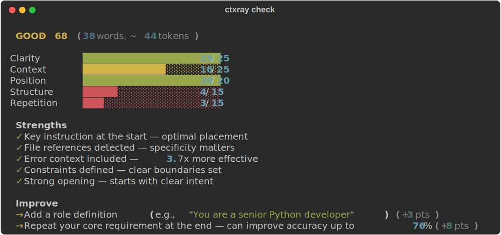
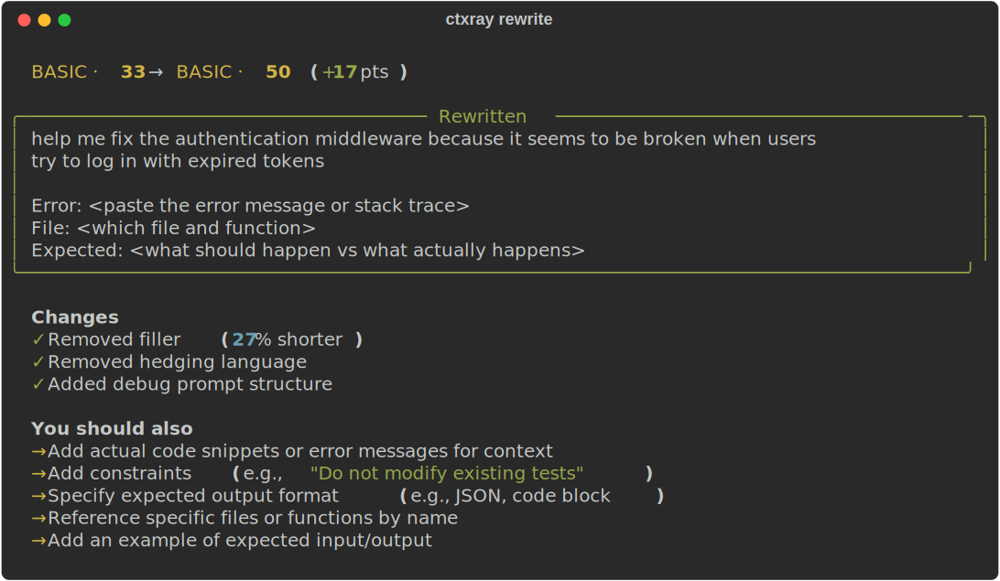
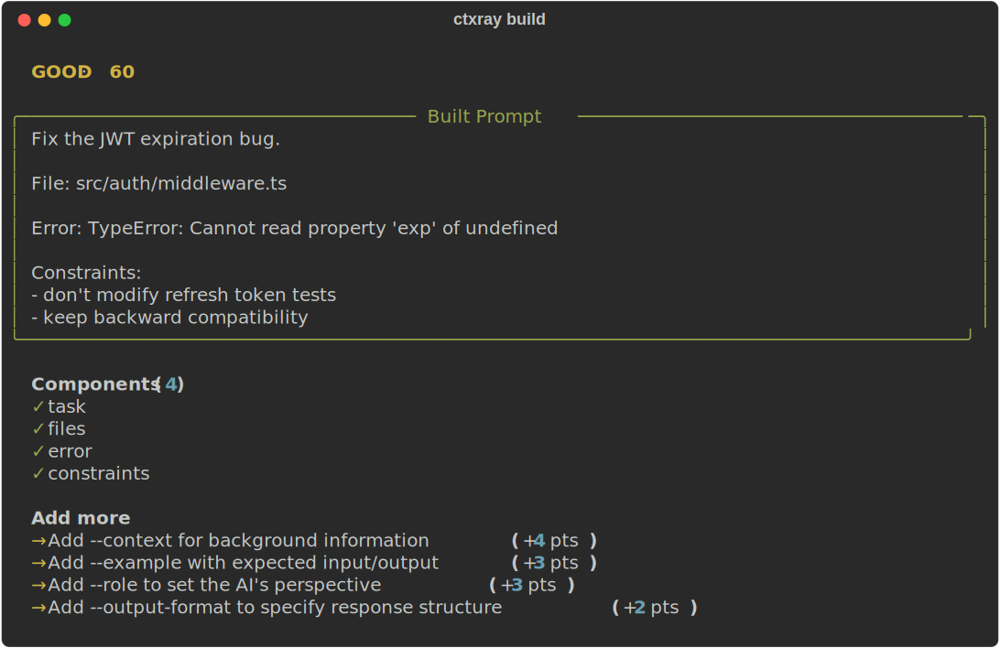
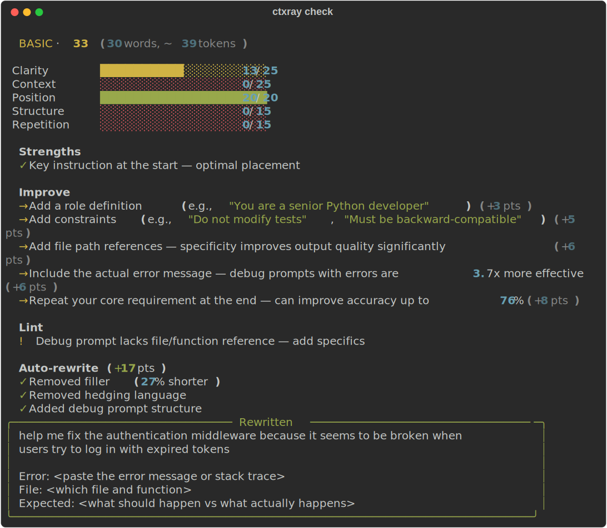

# ctxray

**See how you really use AI.**

X-ray your AI coding sessions across Claude Code, Cursor, ChatGPT, and 6 more tools. Discover your patterns, find wasted tokens, catch leaked secrets — all locally, nothing leaves your machine.

[](https://pypi.org/project/ctxray/)
[](https://pypi.org/project/ctxray/)
[](https://opensource.org/licenses/MIT)
[](https://github.com/ctxray/ctxray/actions)
[](https://github.com/ctxray/ctxray)

## Quick start

```bash
pip install ctxray

ctxray scan                    # discover prompts from your AI tools
ctxray wrapped                 # your AI coding persona + shareable card
ctxray insights                # your patterns vs research-optimal
ctxray privacy                 # what sensitive data you've exposed
```

---


## For teams

Drop ctxray into your CI pipeline as a prompt quality gate. Rule-based, <50ms per prompt, no LLM calls, no API keys, no data leaves your infrastructure.

```yaml
# .github/workflows/prompt-quality.yml
- uses: ctxray/ctxray@main
  with:
    score-threshold: 50
    comment-on-pr: true
```

- **Deterministic** — same prompt, same score, every run. Works in `pre-commit` and CI budgets.
- **Air-gapped by default** — no external API calls, runs in offline/private networks.
- **Independent** — MIT licensed, no vendor lock-in. Promptfoo joined OpenAI. Humanloop joined Anthropic. ctxray is open-source infrastructure that stays yours.

Full setup: [GitHub Action](#ci-integration) · [pre-commit](#pre-commit) · [`.ctxray.toml`](#project-configuration)

## What you'll discover

### Your AI coding persona

`ctxray wrapped` generates a Spotify Wrapped-style report of your AI interactions — your persona (Debugger? Architect? Explorer?), top patterns, and a shareable card.

### Your prompt patterns

`ctxray insights` compares your actual prompting habits against research-backed benchmarks. Are your prompts specific enough? Do you front-load instructions? How much context do you provide?

### Your privacy exposure

`ctxray privacy --deep` scans every prompt you've sent for API keys, tokens, passwords, and PII. See exactly what you've shared with which AI tool.

### Full prompt diagnostic

`ctxray check "your prompt"` scores, lints, and rewrites in one command — no LLM, <50ms.



<details>
<summary>More screenshots</summary>

### `ctxray rewrite` — rule-based prompt improvement



### `ctxray build` — assemble prompts from components



### What a bad prompt looks like


</details>

## All commands

### Discover your patterns

| Command | Description |
|---------|-------------|
| `ctxray wrapped` | AI coding persona + shareable card |
| `ctxray insights` | Personal patterns vs research-optimal benchmarks |
| `ctxray sessions` | Session quality scores with frustration signal detection |
| `ctxray agent` | Agent workflow analysis — error loops, tool patterns, efficiency |
| `ctxray repetition` | Cross-session repetition detection — spot recurring prompts |
| `ctxray patterns` | Personal prompt weaknesses — recurring gaps by task type |
| `ctxray distill` | Extract important turns from conversations with 6-signal scoring |
| `ctxray projects` | Per-project quality breakdown |
| `ctxray style` | Prompting fingerprint with `--trends` for evolution tracking |
| `ctxray privacy` | See what data you sent where — file paths, errors, PII exposure |

### Optimize your prompts

| Command | Description |
|---------|-------------|
| `ctxray check "prompt"` | **Full diagnostic** — score + lint + rewrite in one command |
| `ctxray score "prompt"` | Research-backed 0-100 scoring with 30+ features |
| `ctxray rewrite "prompt"` | Rule-based improvement — filler removal, restructuring, hedging cleanup |
| `ctxray build "task"` | Build prompts from components — task, context, files, errors, constraints |
| `ctxray compress "prompt"` | 4-layer prompt compression (40-60% token savings typical) |
| `ctxray compare "a" "b"` | Side-by-side prompt analysis (or `--best-worst` for auto-selection) |
| `ctxray lint` | Configurable linter with CI/GitHub Action support |

### Manage

| Command | Description |
|---------|-------------|
| `ctxray` | Instant dashboard — prompts, sessions, avg score, top categories |
| `ctxray scan` | Auto-discover prompts from 9 AI tools |
| `ctxray report` | Full analytics: hot phrases, clusters, patterns (`--html` for dashboard) |
| `ctxray digest` | Weekly summary comparing current vs previous period |
| `ctxray template save\|list\|use` | Save and reuse your best prompts |
| `ctxray distill --export` | Recover context when a session runs out — paste into new session |
| `ctxray init` | Generate `.ctxray.toml` config for your project |

## Supported AI tools

| Tool | Format | Auto-discovered by `scan` |
|------|--------|--------------------------|
| Claude Code | JSONL | Yes |
| Codex CLI | JSONL | Yes |
| Cursor | .vscdb | Yes |
| Aider | Markdown | Yes |
| Gemini CLI | JSON | Yes |
| Cline (VS Code) | JSON | Yes |
| OpenClaw / OpenCode | JSON | Yes |
| ChatGPT | JSON | Via `ctxray import` |
| Claude.ai | JSON/ZIP | Via `ctxray import` |

## Installation

```bash
pip install ctxray              # core (all features, zero config)
pip install ctxray[chinese]     # + Chinese prompt analysis (jieba)
pip install ctxray[mcp]         # + MCP server for Claude Code / Continue.dev / Zed
```

### Auto-scan after every session

```bash
ctxray install-hook             # adds post-session hook to Claude Code
```

### Browser extension

Capture prompts from ChatGPT, Claude.ai, and Gemini directly in your browser. Live quality badge shows prompt tier as you type — click "Rewrite & Apply" to improve and replace the text directly in the input box.

1. **Install the extension** from [Chrome Web Store](https://chromewebstore.google.com/detail/reprompt/ojdccpagaanchmkninlbgbgemdcjckhn) or [Firefox Add-ons](https://addons.mozilla.org/addon/reprompt-cli/)
2. **Connect to the CLI:** `ctxray install-extension`
3. **Verify:** `ctxray extension-status`

Captured prompts sync locally via Native Messaging — nothing leaves your machine.

### CI integration

#### GitHub Action

```yaml
# .github/workflows/prompt-lint.yml
name: Prompt Quality
on: pull_request

jobs:
  lint:
    runs-on: ubuntu-latest
    permissions:
      pull-requests: write
    steps:
      - uses: actions/checkout@v4
      - uses: ctxray/ctxray@main
        with:
          score-threshold: 50
          strict: true
          comment-on-pr: true
```

#### pre-commit

```yaml
# .pre-commit-config.yaml
repos:
  - repo: https://github.com/ctxray/ctxray
    rev: v3.0.0
    hooks:
      - id: ctxray-lint
```

#### Direct CLI

```bash
ctxray lint --score-threshold 50  # exit 1 if avg score < 50
ctxray lint --strict              # exit 1 on warnings
ctxray lint --json                # machine-readable output
```

#### Project configuration

```bash
ctxray init   # generates .ctxray.toml with all rules documented
```

```toml
# .ctxray.toml (or [tool.ctxray.lint] in pyproject.toml)
[lint]
score-threshold = 50

[lint.rules]
min-length = 20
short-prompt = 40
vague-prompt = true
debug-needs-reference = true
```

<details>
<summary>Prompt Science — research foundation</summary>

## Prompt Science

Scoring is calibrated against 10 peer-reviewed papers covering 30+ features across 5 dimensions:

| Dimension | What it measures | Key papers |
|-----------|-----------------|------------|
| **Structure** | Markdown, code blocks, explicit constraints | Prompt Report ([2406.06608](https://arxiv.org/abs/2406.06608)) |
| **Context** | File paths, error messages, I/O specs, edge cases | Zi+ ([2508.03678](https://arxiv.org/abs/2508.03678)), Google ([2512.14982](https://arxiv.org/abs/2512.14982)) |
| **Position** | Instruction placement relative to context | Stanford ([2307.03172](https://arxiv.org/abs/2307.03172)), Veseli+ ([2508.07479](https://arxiv.org/abs/2508.07479)), Chowdhury ([2603.10123](https://arxiv.org/abs/2603.10123)) |
| **Repetition** | Redundancy that degrades model attention | Google ([2512.14982](https://arxiv.org/abs/2512.14982)) |
| **Clarity** | Readability, sentence length, ambiguity | SPELL (EMNLP 2023), PEEM ([2603.10477](https://arxiv.org/abs/2603.10477)) |

Cross-validated findings that inform our engine:

- **Position bias is architectural** — present at initialization, not learned. Front-loading instructions is effective for prompts under 50% of context window (3 papers agree)
- **Moderate compression improves output** — rule-based filler removal doesn't just save tokens, it enhances LLM performance ([2505.00019](https://arxiv.org/abs/2505.00019))
- **Prompt quality is independently measurable** — prompt-only scoring predicts output quality without seeing the response (ACL 2025, [2503.10084](https://arxiv.org/abs/2503.10084))

All analysis runs locally in <1ms per prompt. No LLM calls, no network requests.

</details>

<details>
<summary>How it works — architecture</summary>

## How it works

```
 Data sources:
 ┌──────────┐ ┌──────────┐ ┌──────────┐ ┌──────────┐ ┌──────────┐
 │Claude Code│ │  Cursor  │ │  Aider   │ │ ChatGPT  │ │ 5 more.. │
 └─────┬────┘ └─────┬────┘ └─────┬────┘ └─────┬────┘ └─────┬────┘
       └─────────────┴───────────┴─────────────┴─────────────┘
                                 │
                    scan -> dedup -> store -> analyze
                                 │
              ┌──────────────────┼──────────────────┐
              v                  v                  v
        ┌──────────┐     ┌──────────────┐    ┌──────────┐
        │ insights │     │  patterns    │    │ sessions │
        │ wrapped  │     │  repetition  │    │ projects │
        │ style    │     │  privacy     │    │ agent    │
        └──────────┘     └──────────────┘    └──────────┘
```

**Key design decisions:**
- **Pure rules, no LLM** — scoring and rewriting use regex + TF-IDF + research heuristics. Deterministic, private, <1ms per prompt.
- **Adapter pattern** — each AI tool gets a parser that normalizes to a common `Prompt` model. Adding a new tool = one file.
- **Two-layer dedup** — SHA-256 for exact matches, TF-IDF cosine similarity for near-dupes.
- **Research-calibrated** — 10 peer-reviewed papers inform the scoring weights.

</details>

<details>
<summary>Conversation Distillation</summary>

## Conversation Distillation

`ctxray distill` scores every turn in a conversation using 6 signals:

- **Position** — first/last turns carry framing and conclusions
- **Length** — substantial turns contain more information
- **Tool trigger** — turns that cause tool calls are action-driving
- **Error recovery** — turns that follow errors show problem-solving
- **Semantic shift** — topic changes mark conversation boundaries
- **Uniqueness** — novel phrasing vs repetitive follow-ups

Session type (debugging, feature-dev, exploration, refactoring) is auto-detected and signal weights adapt accordingly.

</details>

## Why ctxray?

After [Promptfoo joined OpenAI](https://openai.com/index/openai-to-acquire-promptfoo/) and [Humanloop joined Anthropic](https://techcrunch.com/2025/08/13/anthropic-nabs-humanloop-team-as-competition-for-enterprise-ai-talent-heats-up/), ctxray is the independent, open-source alternative for understanding your AI interactions.

- **100% local** — your prompts never leave your machine
- **No LLM required** — pure rule-based analysis, <50ms per prompt
- **9 AI tools** — the only tool that works across Claude Code, Cursor, ChatGPT, and more
- **Research-backed** — calibrated against 10 peer-reviewed papers, not vibes

> Previously published as `reprompt-cli`. Same tool, new name, clean namespace.

## Privacy

- All analysis runs locally. No prompts leave your machine.
- `ctxray privacy` shows exactly what you've sent to which AI tool.
- Optional telemetry sends only anonymous feature vectors — never prompt text.
- Open source: audit exactly what's collected.

## Links

- **PyPI:** [ctxray](https://pypi.org/project/ctxray/)
- **Chrome Extension:** [Chrome Web Store](https://chromewebstore.google.com/detail/reprompt/ojdccpagaanchmkninlbgbgemdcjckhn)
- **Firefox Add-on:** [Firefox Add-ons](https://addons.mozilla.org/addon/reprompt-cli/)
- **Changelog:** [CHANGELOG.md](CHANGELOG.md)

## Contributing

See [CONTRIBUTING.md](CONTRIBUTING.md) for development setup and guidelines.

## License

MIT
